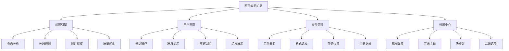
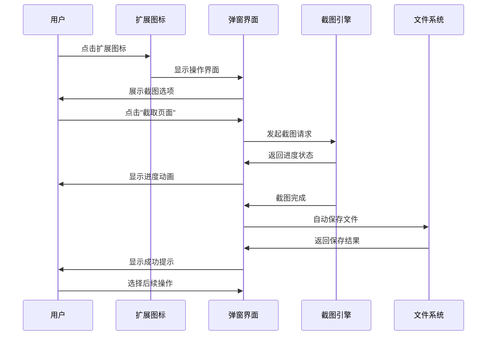
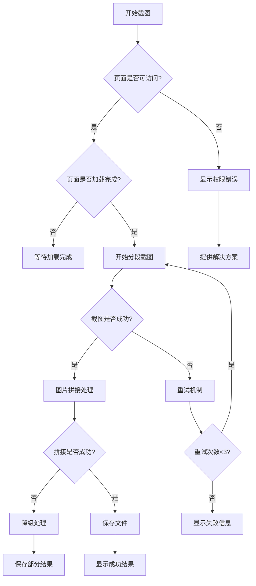

# 网页长图截取Chrome扩展开发文档

## 📋 项目概述

### 项目目标
开发一个Chrome浏览器扩展，实现一键截取整个网页的长图功能，满足用户快速保存不可复制网页内容的需求。

### 核心功能
- 🖼️ 一键截取完整网页长图
- 📱 支持响应式页面截图
- 🎯 简单易用的用户界面
- ⚡ 快速处理，无需等待

### 技术特点
- 纯前端实现，无需服务器
- 基于Chrome Extension API
- 支持动态内容截图
- 自动处理页面滚动和拼接

## � 快速开始（精简版）

### 安装与加载
1. 打开 Chrome → 访问 chrome://extensions/
2. 开启“开发者模式”
3. 点击“加载已解压的扩展程序”，选择 `webpage-screenshot-extension` 目录
4. 浏览器工具栏出现相机图标即安装成功

### 基本使用
- 打开任意网页 → 点击扩展图标 → 点击“截取完整页面”
- 截图完成后：
  - 先“预览”确认效果（可展开/放大）
  - 可“一键复制”至剪贴板，或“下载图片”保存

### 适配范围
- 支持：HTTP/HTTPS 页面、内嵌滚动容器、动态内容、长页面
- 不支持：chrome://、扩展页、新标签页、部分 file://

---

## 🧭 项目结构（概览）
```
webpage-screenshot-extension/
├── manifest.json
├── popup/          # 弹窗UI与交互
│   ├── popup.html
│   ├── popup.css
│   └── popup.js
├── content/        # 页面注入脚本（核心截图逻辑）
│   └── content.js
├── background/     # 后台服务与API桥接
│   └── background.js
├── icons/          # 扩展图标（附生成器）
│   └── create-icons.html
└── test-page.html  # 本地测试页
```

---

## 🔑 核心实现要点（必读）

- manifest.json（MV3）
  - 权限：activeTab、scripting、downloads、clipboardWrite
  - 背景：service_worker 负责 `captureVisibleTab`
  - content_scripts：限定在 http/https，document_idle 注入

- popup 弹窗
  - 负责发起截图指令、实时状态、超时保护（30s）
  - 提供预览、复制到剪贴板、下载到本地
  - 若页面为受限地址会给出友好提示

- content 截图引擎
  - 自动识别“主滚动容器”（文档或内嵌 overflow 容器）
  - 分段滚动 → `chrome.tabs.captureVisibleTab` → Canvas 无缝拼接
  - 截图前隐藏 `position: fixed|sticky` 元素，结束后恢复
  - 基于 DPR/scale 的像素对齐与 1px 安全重叠，避免拼接横线
  - 用页面真实背景色填充底色，消除色差线

- background 后台
  - 作为截图 API 的统一入口
  - 处理错误并回传给前端

---

## 🧪 测试与调试（要点）
- Popup 调试：右键图标 → 检查弹出内容
- Content 调试：F12 → Console（在目标页）
- Background 调试：chrome://extensions/ → 背景页 → 检查视图
- 本地测试：打开 `test-page.html`（包含进度条、长列表、动态内容）

---

## 🐞 常见问题与排查
- 只能截取可见区：很多站点滚的是内嵌容器（已自动识别），若仍失败可刷新页面重试
- 拼接有横线：多由固定元素或像素对齐导致（已处理），可反馈具体站点复现
- 连接失败：若提示“无法与页面脚本通信”，刷新页面或重新加载扩展
- 图片过大：长图属于正常较大体积，可后续外部压缩

---

## 📦 发布流程（摘要）
1. 生成图标：打开 icons/create-icons.html 下载 16/48/128 图标
2. 功能自测：test-page.html + 实站各 1~2 个
3. 压缩打包：zip -r webpage-screenshot-extension.zip webpage-screenshot-extension/
4. 上架商店：注册开发者（$5 一次性）→ 上传 zip → 填写信息 → 提交审核

---

## 🔭 下一步建议
- 手动选择主滚动容器（拾取器），适配极端布局
- iframe 内容截图与合成
- 高级导出（分块/流式，适配超超长页面）
- 可配置质量/格式/命名规则
- 错误自动重试与更细粒度的进度反馈

<!-- 以下为历史产品设计详述，已不再作为开发必读内容，后续如需恢复请查看历史版本。 -->

#### 目标用户画像
**主要用户群体：**
1. **内容创作者** (30%)
   - 博主、自媒体作者、设计师
   - 需要保存网页内容作为素材
   - 重视截图质量和效率

2. **学习研究者** (25%)
   - 学生、研究人员、知识工作者
   - 需要保存学习资料和参考文档
   - 注重完整性和可读性

3. **商务人士** (20%)
   - 市场分析师、产品经理、销售
   - 需要保存竞品分析和市场信息
   - 要求操作简单快捷

4. **普通网民** (25%)
   - 日常网络用户
   - 偶尔需要保存网页内容
   - 追求简单易用

#### 核心需求分析
| 需求类型 | 具体需求 | 优先级 | 解决方案 |
|---------|---------|--------|---------|
| **功能需求** | 完整页面截图 | 🔴 高 | 分段截图+智能拼接 |
| **性能需求** | 快速响应(<3秒) | 🔴 高 | 异步处理+进度提示 |
| **易用性需求** | 一键操作 | 🔴 高 | 简化界面+智能默认 |
| **质量需求** | 高清无损 | 🟡 中 | 可调节质量选项 |
| **兼容性需求** | 支持各类网站 | 🟡 中 | 多种截图策略 |
| **扩展需求** | 批量处理 | 🟢 低 | 后期版本功能 |

#### 使用场景分析
**场景1：学习笔记制作**
- 用户正在阅读技术文档或教程
- 需要保存完整的页面内容作为笔记
- 要求：高质量、完整性、快速操作

**场景2：设计灵感收集**
- 设计师浏览优秀的网页设计
- 需要保存整个页面的设计细节
- 要求：高保真、色彩准确、细节清晰

**场景3：竞品分析研究**
- 产品经理分析竞争对手网站
- 需要保存完整的产品页面
- 要求：快速批量、组织管理、分享便利

### 产品功能架构

#### 核心功能模块


#### 功能优先级规划
**MVP版本 (v1.0)**
- ✅ 基础截图功能
- ✅ 简洁用户界面
- ✅ 自动下载保存
- ✅ 基础错误处理

**增强版本 (v1.1)**
- 🔄 截图质量选择
- 🔄 自定义文件命名
- 🔄 截图历史记录
- 🔄 快捷键支持

**专业版本 (v2.0)**
- 📋 批量截图功能
- 📋 区域选择截图
- 📋 云端同步存储
- 📋 团队协作功能

### 用户体验设计

#### 交互流程设计


#### 错误处理流程


#### 用户反馈机制
**即时反馈**
- 🔄 实时进度条显示
- ⚡ 操作状态即时更新
- 🎯 清晰的成功/失败提示
- 💡 智能错误解决建议

**延迟反馈**
- 📊 使用统计和分析
- 🌟 用户满意度调研
- 🐛 错误日志收集
- 💬 用户建议收集

## 🎨 UI设计系统

### 设计原则

#### 核心设计理念
1. **简约至上** - 减少认知负担，突出核心功能
2. **效率优先** - 最少点击完成主要任务
3. **视觉清晰** - 信息层次分明，状态明确
4. **情感化设计** - 友好的交互反馈和视觉体验

#### 设计约束
- **尺寸限制**: 弹窗宽度320px，高度自适应
- **性能要求**: 界面响应时间<100ms
- **兼容性**: 支持Chrome 88+版本
- **可访问性**: 符合WCAG 2.1 AA标准

### 视觉设计规范

#### 色彩系统
```css
/* 主色调 - 科技蓝紫渐变 */
--primary-gradient: linear-gradient(135deg, #667eea 0%, #764ba2 100%);
--primary-color: #667eea;
--primary-dark: #5a6fd8;
--primary-light: #7b8ef0;

/* 功能色彩 */
--success-color: #4CAF50;    /* 成功绿 */
--warning-color: #FF9800;    /* 警告橙 */
--error-color: #F44336;      /* 错误红 */
--info-color: #2196F3;       /* 信息蓝 */

/* 中性色彩 */
--text-primary: #333333;     /* 主要文字 */
--text-secondary: #666666;   /* 次要文字 */
--text-disabled: #999999;    /* 禁用文字 */
--background-white: #FFFFFF; /* 背景白 */
--background-gray: #F5F5F5;  /* 背景灰 */
--border-light: #E0E0E0;     /* 浅边框 */
--border-dark: #CCCCCC;      /* 深边框 */

/* 透明度变量 */
--opacity-hover: 0.8;
--opacity-disabled: 0.4;
--opacity-overlay: 0.1;
```

#### 字体系统
```css
/* 字体族 */
--font-family: -apple-system, BlinkMacSystemFont, 'Segoe UI',
               Roboto, 'Helvetica Neue', Arial, sans-serif;

/* 字体大小 */
--font-size-xs: 10px;    /* 辅助信息 */
--font-size-sm: 12px;    /* 小号文字 */
--font-size-base: 14px;  /* 基础文字 */
--font-size-lg: 16px;    /* 大号文字 */
--font-size-xl: 18px;    /* 标题文字 */
--font-size-xxl: 20px;   /* 大标题 */

/* 字体粗细 */
--font-weight-normal: 400;
--font-weight-medium: 500;
--font-weight-semibold: 600;
--font-weight-bold: 700;

/* 行高 */
--line-height-tight: 1.2;
--line-height-normal: 1.4;
--line-height-relaxed: 1.6;
```

#### 间距系统
```css
/* 基础间距单位 */
--spacing-xs: 4px;
--spacing-sm: 8px;
--spacing-md: 12px;
--spacing-lg: 16px;
--spacing-xl: 20px;
--spacing-xxl: 24px;
--spacing-xxxl: 32px;

/* 组件间距 */
--component-padding: var(--spacing-lg);
--component-margin: var(--spacing-md);
--section-spacing: var(--spacing-xl);
```

#### 圆角和阴影
```css
/* 圆角 */
--border-radius-sm: 4px;
--border-radius-md: 8px;
--border-radius-lg: 12px;
--border-radius-xl: 16px;
--border-radius-full: 50%;

/* 阴影 */
--shadow-sm: 0 1px 3px rgba(0,0,0,0.1);
--shadow-md: 0 4px 15px rgba(0,0,0,0.1);
--shadow-lg: 0 6px 20px rgba(0,0,0,0.15);
--shadow-xl: 0 10px 30px rgba(0,0,0,0.2);

/* 特殊效果 */
--shadow-inset: inset 0 1px 3px rgba(0,0,0,0.1);
--shadow-focus: 0 0 0 3px rgba(102, 126, 234, 0.3);
```

### 组件设计规范

#### 按钮组件
```css
/* 主要按钮 */
.btn-primary {
  background: var(--primary-gradient);
  color: white;
  border: none;
  border-radius: var(--border-radius-lg);
  padding: var(--spacing-md) var(--spacing-xl);
  font-size: var(--font-size-base);
  font-weight: var(--font-weight-medium);
  cursor: pointer;
  transition: all 0.3s ease;
  box-shadow: var(--shadow-md);

  display: flex;
  align-items: center;
  justify-content: center;
  gap: var(--spacing-sm);
  min-height: 44px; /* 触摸友好 */
}

.btn-primary:hover {
  transform: translateY(-2px);
  box-shadow: var(--shadow-lg);
  opacity: var(--opacity-hover);
}

.btn-primary:active {
  transform: translateY(0);
  box-shadow: var(--shadow-sm);
}

.btn-primary:disabled {
  opacity: var(--opacity-disabled);
  cursor: not-allowed;
  transform: none;
}

/* 次要按钮 */
.btn-secondary {
  background: var(--background-white);
  color: var(--primary-color);
  border: 1px solid var(--primary-color);
  border-radius: var(--border-radius-md);
  padding: var(--spacing-sm) var(--spacing-lg);
  font-size: var(--font-size-sm);
  font-weight: var(--font-weight-medium);
  cursor: pointer;
  transition: all 0.2s ease;
}

.btn-secondary:hover {
  background: var(--primary-color);
  color: white;
}

/* 图标按钮 */
.btn-icon {
  width: 32px;
  height: 32px;
  border-radius: var(--border-radius-md);
  border: none;
  background: transparent;
  cursor: pointer;
  display: flex;
  align-items: center;
  justify-content: center;
  transition: background 0.2s ease;
}

.btn-icon:hover {
  background: rgba(102, 126, 234, 0.1);
}
```

#### 状态指示器
```css
/* 加载动画 */
.loading-spinner {
  width: 20px;
  height: 20px;
  border: 2px solid rgba(255,255,255,0.3);
  border-top: 2px solid white;
  border-radius: var(--border-radius-full);
  animation: spin 1s linear infinite;
}

@keyframes spin {
  0% { transform: rotate(0deg); }
  100% { transform: rotate(360deg); }
}

/* 进度条 */
.progress-bar {
  width: 100%;
  height: 4px;
  background: var(--background-gray);
  border-radius: var(--border-radius-sm);
  overflow: hidden;
}

.progress-fill {
  height: 100%;
  background: var(--primary-gradient);
  border-radius: var(--border-radius-sm);
  transition: width 0.3s ease;
  animation: progress-shimmer 2s infinite;
}

@keyframes progress-shimmer {
  0% { opacity: 0.8; }
  50% { opacity: 1; }
  100% { opacity: 0.8; }
}

/* 状态徽章 */
.status-badge {
  display: inline-flex;
  align-items: center;
  gap: var(--spacing-xs);
  padding: var(--spacing-xs) var(--spacing-sm);
  border-radius: var(--border-radius-md);
  font-size: var(--font-size-xs);
  font-weight: var(--font-weight-medium);
}

.status-badge.success {
  background: rgba(76, 175, 80, 0.1);
  color: var(--success-color);
}

.status-badge.error {
  background: rgba(244, 67, 54, 0.1);
  color: var(--error-color);
}

.status-badge.warning {
  background: rgba(255, 152, 0, 0.1);
  color: var(--warning-color);
}
```

#### 卡片和容器
```css
/* 主容器 */
.main-container {
  width: 320px;
  background: var(--primary-gradient);
  border-radius: var(--border-radius-lg);
  overflow: hidden;
  box-shadow: var(--shadow-xl);
}

/* 内容卡片 */
.content-card {
  background: var(--background-white);
  border-radius: var(--border-radius-lg);
  padding: var(--spacing-xl);
  margin: var(--spacing-lg);
  box-shadow: var(--shadow-sm);
}

/* 功能区块 */
.feature-section {
  padding: var(--spacing-lg);
  border-bottom: 1px solid var(--border-light);
}

.feature-section:last-child {
  border-bottom: none;
}

/* 信息提示框 */
.info-box {
  background: rgba(33, 150, 243, 0.1);
  border-left: 4px solid var(--info-color);
  padding: var(--spacing-md);
  border-radius: var(--border-radius-sm);
  margin: var(--spacing-md) 0;
}

.info-box .icon {
  color: var(--info-color);
  margin-right: var(--spacing-sm);
}
```

### 交互设计指南

#### 微交互设计
```css
/* 悬停效果 */
.interactive-element {
  transition: all 0.2s cubic-bezier(0.4, 0, 0.2, 1);
}

.interactive-element:hover {
  transform: translateY(-1px);
  box-shadow: var(--shadow-md);
}

/* 点击反馈 */
.clickable {
  position: relative;
  overflow: hidden;
}

.clickable::after {
  content: '';
  position: absolute;
  top: 50%;
  left: 50%;
  width: 0;
  height: 0;
  background: rgba(255, 255, 255, 0.3);
  border-radius: var(--border-radius-full);
  transform: translate(-50%, -50%);
  transition: width 0.3s, height 0.3s;
}

.clickable:active::after {
  width: 200px;
  height: 200px;
}

/* 焦点状态 */
.focusable:focus {
  outline: none;
  box-shadow: var(--shadow-focus);
}

/* 禁用状态 */
.disabled {
  opacity: var(--opacity-disabled);
  cursor: not-allowed;
  pointer-events: none;
}
```

#### 动画时序
```css
/* 动画时长标准 */
:root {
  --duration-fast: 0.15s;      /* 快速反馈 */
  --duration-normal: 0.3s;     /* 标准动画 */
  --duration-slow: 0.5s;       /* 慢速过渡 */
  --duration-extra-slow: 0.8s; /* 特殊效果 */
}

/* 缓动函数 */
:root {
  --ease-out: cubic-bezier(0.4, 0, 0.2, 1);
  --ease-in: cubic-bezier(0.4, 0, 1, 1);
  --ease-in-out: cubic-bezier(0.4, 0, 0.2, 1);
  --ease-bounce: cubic-bezier(0.68, -0.55, 0.265, 1.55);
}

/* 页面进入动画 */
.fade-in {
  animation: fadeIn var(--duration-normal) var(--ease-out);
}

@keyframes fadeIn {
  from {
    opacity: 0;
    transform: translateY(10px);
  }
  to {
    opacity: 1;
    transform: translateY(0);
  }
}

/* 成功动画 */
.success-animation {
  animation: successPulse var(--duration-slow) var(--ease-bounce);
}

@keyframes successPulse {
  0% { transform: scale(1); }
  50% { transform: scale(1.05); }
  100% { transform: scale(1); }
}
```

### 响应式设计

#### 弹窗尺寸适配
```css
/* 基础弹窗尺寸 */
.popup-container {
  width: 320px;
  min-height: 200px;
  max-height: 600px;
  overflow-y: auto;
}

/* 小屏幕适配 */
@media (max-width: 360px) {
  .popup-container {
    width: 280px;
    padding: var(--spacing-md);
  }

  .btn-primary {
    padding: var(--spacing-sm) var(--spacing-lg);
    font-size: var(--font-size-sm);
  }
}

/* 高分辨率屏幕 */
@media (-webkit-min-device-pixel-ratio: 2) {
  .icon {
    image-rendering: -webkit-optimize-contrast;
  }
}
```

#### 可访问性设计
```css
/* 高对比度模式 */
@media (prefers-contrast: high) {
  :root {
    --text-primary: #000000;
    --background-white: #FFFFFF;
    --border-light: #000000;
  }
}

/* 减少动画模式 */
@media (prefers-reduced-motion: reduce) {
  * {
    animation-duration: 0.01ms !important;
    animation-iteration-count: 1 !important;
    transition-duration: 0.01ms !important;
  }
}

/* 焦点可见性 */
.sr-only {
  position: absolute;
  width: 1px;
  height: 1px;
  padding: 0;
  margin: -1px;
  overflow: hidden;
  clip: rect(0, 0, 0, 0);
  white-space: nowrap;
  border: 0;
}

/* 键盘导航 */
.keyboard-navigation .focusable:focus {
  outline: 2px solid var(--primary-color);
  outline-offset: 2px;
}
```

## 🏗️ 技术架构

### 核心技术栈
- **HTML5** - 用户界面结构
- **CSS3** - 样式和布局
- **JavaScript (ES6+)** - 核心逻辑实现
- **Chrome Extension API** - 浏览器扩展接口

### 关键API
- `chrome.tabs` - 标签页操作
- `chrome.scripting` - 脚本注入
- `chrome.action` - 扩展图标和弹窗
- `chrome.permissions` - 权限管理
- `HTML5 Canvas` - 图片处理和拼接

### 架构组件
```
Chrome Extension
├── manifest.json      # 扩展配置文件
├── popup/             # 弹窗界面
│   ├── popup.html     # 弹窗HTML
│   ├── popup.css      # 弹窗样式
│   └── popup.js       # 弹窗逻辑
├── content/           # 内容脚本
│   └── content.js     # 页面注入脚本
├── background/        # 后台脚本
│   └── background.js  # 后台服务
├── icons/             # 图标资源
└── utils/             # 工具函数
    └── screenshot.js  # 截图核心逻辑
```

## 🛠️ 开发环境准备

### 必需软件
1. **Google Chrome浏览器** (版本88+)
2. **代码编辑器** (推荐VS Code)
3. **Git** (版本控制，可选)

### VS Code推荐插件
- JavaScript (ES6) code snippets
- Chrome Extension Development
- Live Server
- Prettier - Code formatter

### 开发者模式设置
1. 打开Chrome浏览器
2. 访问 `chrome://extensions/`
3. 开启右上角"开发者模式"
4. 准备加载未打包的扩展

## 📁 项目文件结构

创建以下目录结构：
```
webpage-screenshot-extension/
├── manifest.json
├── popup/
│   ├── popup.html
│   ├── popup.css
│   └── popup.js
├── content/
│   └── content.js
├── background/
│   └── background.js
├── icons/
│   ├── icon16.png
│   ├── icon48.png
│   └── icon128.png
├── utils/
│   └── screenshot.js
└── README.md
```

## 🔧 核心代码实现

### 1. manifest.json (扩展配置)
```json
{
  "manifest_version": 3,
  "name": "网页长图截取工具",
  "version": "1.0.0",
  "description": "一键截取完整网页长图，保存不可复制的网页内容",
  
  "permissions": [
    "activeTab",
    "scripting",
    "downloads"
  ],
  
  "action": {
    "default_popup": "popup/popup.html",
    "default_icon": {
      "16": "icons/icon16.png",
      "48": "icons/icon48.png",
      "128": "icons/icon128.png"
    }
  },
  
  "background": {
    "service_worker": "background/background.js"
  },
  
  "content_scripts": [
    {
      "matches": ["<all_urls>"],
      "js": ["content/content.js"],
      "run_at": "document_end"
    }
  ],
  
  "icons": {
    "16": "icons/icon16.png",
    "48": "icons/icon48.png",
    "128": "icons/icon128.png"
  }
}
```

### 2. popup/popup.html (弹窗界面)
```html
<!DOCTYPE html>
<html>
<head>
  <meta charset="utf-8">
  <link rel="stylesheet" href="popup.css">
</head>
<body>
  <div class="container">
    <div class="header">
      <h2>📸 网页截图工具</h2>
    </div>
    
    <div class="content">
      <button id="captureBtn" class="capture-btn">
        <span class="icon">🖼️</span>
        <span class="text">截取完整页面</span>
      </button>
      
      <div id="status" class="status hidden">
        <div class="loading">
          <div class="spinner"></div>
          <span>正在截取中...</span>
        </div>
      </div>
      
      <div id="result" class="result hidden">
        <p class="success">✅ 截图完成！</p>
        <button id="downloadBtn" class="download-btn">下载图片</button>
      </div>
    </div>
    
    <div class="footer">
      <p class="tip">💡 点击按钮开始截取当前页面</p>
    </div>
  </div>
  
  <script src="popup.js"></script>
</body>
</html>
```

### 3. popup/popup.css (弹窗样式 - 基于设计系统)
```css
/* CSS变量定义 - 基于设计系统 */
:root {
  /* 主色调 */
  --primary-gradient: linear-gradient(135deg, #667eea 0%, #764ba2 100%);
  --primary-color: #667eea;
  --primary-dark: #5a6fd8;

  /* 功能色彩 */
  --success-color: #4CAF50;
  --warning-color: #FF9800;
  --error-color: #F44336;
  --info-color: #2196F3;

  /* 中性色彩 */
  --text-primary: #333333;
  --text-secondary: #666666;
  --text-light: rgba(255,255,255,0.9);
  --background-white: #FFFFFF;
  --background-overlay: rgba(255,255,255,0.1);

  /* 字体系统 */
  --font-family: -apple-system, BlinkMacSystemFont, 'Segoe UI', Roboto, 'Helvetica Neue', Arial, sans-serif;
  --font-size-xs: 10px;
  --font-size-sm: 12px;
  --font-size-base: 14px;
  --font-size-lg: 16px;
  --font-size-xl: 18px;
  --font-weight-normal: 400;
  --font-weight-medium: 500;
  --font-weight-semibold: 600;

  /* 间距系统 */
  --spacing-xs: 4px;
  --spacing-sm: 8px;
  --spacing-md: 12px;
  --spacing-lg: 16px;
  --spacing-xl: 20px;
  --spacing-xxl: 24px;

  /* 圆角和阴影 */
  --border-radius-sm: 4px;
  --border-radius-md: 8px;
  --border-radius-lg: 12px;
  --border-radius-xl: 16px;
  --shadow-sm: 0 1px 3px rgba(0,0,0,0.1);
  --shadow-md: 0 4px 15px rgba(0,0,0,0.1);
  --shadow-lg: 0 6px 20px rgba(0,0,0,0.15);
  --shadow-focus: 0 0 0 3px rgba(102, 126, 234, 0.3);

  /* 动画 */
  --duration-fast: 0.15s;
  --duration-normal: 0.3s;
  --ease-out: cubic-bezier(0.4, 0, 0.2, 1);
}

/* 基础重置 */
* {
  margin: 0;
  padding: 0;
  box-sizing: border-box;
}

/* 主体样式 */
body {
  width: 320px;
  font-family: var(--font-family);
  background: var(--primary-gradient);
  color: var(--text-primary);
  line-height: 1.4;
  -webkit-font-smoothing: antialiased;
  -moz-osx-font-smoothing: grayscale;
}

/* 主容器 */
.container {
  padding: var(--spacing-xl);
  animation: fadeIn var(--duration-normal) var(--ease-out);
}

@keyframes fadeIn {
  from {
    opacity: 0;
    transform: translateY(10px);
  }
  to {
    opacity: 1;
    transform: translateY(0);
  }
}

/* 头部区域 */
.header {
  text-align: center;
  margin-bottom: var(--spacing-xl);
}

.header h2 {
  color: var(--text-light);
  font-size: var(--font-size-xl);
  font-weight: var(--font-weight-semibold);
  margin-bottom: var(--spacing-xs);
  text-shadow: 0 1px 2px rgba(0,0,0,0.1);
}

/* 内容区域 */
.content {
  background: var(--background-white);
  border-radius: var(--border-radius-lg);
  padding: var(--spacing-xl);
  box-shadow: var(--shadow-lg);
  margin-bottom: var(--spacing-lg);
}

/* 主要操作按钮 */
.capture-btn {
  width: 100%;
  min-height: 48px;
  padding: var(--spacing-md) var(--spacing-xl);
  background: var(--primary-gradient);
  color: white;
  border: none;
  border-radius: var(--border-radius-lg);
  cursor: pointer;
  transition: all var(--duration-normal) var(--ease-out);
  box-shadow: var(--shadow-md);

  display: flex;
  align-items: center;
  justify-content: center;
  gap: var(--spacing-sm);

  font-size: var(--font-size-lg);
  font-weight: var(--font-weight-medium);
  font-family: inherit;

  position: relative;
  overflow: hidden;
}

.capture-btn:hover {
  transform: translateY(-2px);
  box-shadow: var(--shadow-lg);
}

.capture-btn:active {
  transform: translateY(0);
  box-shadow: var(--shadow-sm);
}

.capture-btn:focus {
  outline: none;
  box-shadow: var(--shadow-focus);
}

.capture-btn:disabled {
  opacity: 0.6;
  cursor: not-allowed;
  transform: none;
}

/* 按钮图标和文字 */
.capture-btn .icon {
  font-size: 20px;
  line-height: 1;
}

.capture-btn .text {
  font-size: var(--font-size-lg);
  font-weight: var(--font-weight-medium);
}

/* 状态显示区域 */
.status {
  text-align: center;
  padding: var(--spacing-xl);
  background: var(--background-overlay);
  border-radius: var(--border-radius-lg);
  margin: var(--spacing-lg) 0;
}

.loading {
  display: flex;
  align-items: center;
  justify-content: center;
  gap: var(--spacing-md);
  color: var(--text-light);
  font-size: var(--font-size-base);
  font-weight: var(--font-weight-medium);
}

/* 加载动画 */
.spinner {
  width: 20px;
  height: 20px;
  border: 2px solid rgba(255,255,255,0.3);
  border-top: 2px solid white;
  border-radius: 50%;
  animation: spin 1s linear infinite;
}

@keyframes spin {
  0% { transform: rotate(0deg); }
  100% { transform: rotate(360deg); }
}

/* 结果显示区域 */
.result {
  text-align: center;
  padding: var(--spacing-xl);
  background: var(--background-white);
  border-radius: var(--border-radius-lg);
  box-shadow: var(--shadow-sm);
  animation: successSlideIn var(--duration-normal) var(--ease-out);
}

@keyframes successSlideIn {
  from {
    opacity: 0;
    transform: translateY(20px);
  }
  to {
    opacity: 1;
    transform: translateY(0);
  }
}

.success {
  color: var(--success-color);
  font-weight: var(--font-weight-medium);
  font-size: var(--font-size-base);
  margin-bottom: var(--spacing-lg);
  display: flex;
  align-items: center;
  justify-content: center;
  gap: var(--spacing-sm);
}

/* 下载按钮 */
.download-btn {
  padding: var(--spacing-md) var(--spacing-xl);
  background: var(--success-color);
  color: white;
  border: none;
  border-radius: var(--border-radius-md);
  cursor: pointer;
  font-size: var(--font-size-base);
  font-weight: var(--font-weight-medium);
  font-family: inherit;
  transition: all var(--duration-normal) var(--ease-out);
  box-shadow: var(--shadow-sm);

  display: flex;
  align-items: center;
  justify-content: center;
  gap: var(--spacing-xs);
}

.download-btn:hover {
  background: #45a049;
  transform: translateY(-1px);
  box-shadow: var(--shadow-md);
}

.download-btn:active {
  transform: translateY(0);
  box-shadow: var(--shadow-sm);
}

.download-btn:focus {
  outline: none;
  box-shadow: var(--shadow-focus);
}

/* 页脚区域 */
.footer {
  text-align: center;
  margin-top: var(--spacing-lg);
  padding: 0 var(--spacing-lg);
}

.tip {
  font-size: var(--font-size-sm);
  color: var(--text-light);
  opacity: 0.8;
  line-height: 1.4;
}

/* 工具类 */
.hidden {
  display: none !important;
}

.fade-in {
  animation: fadeIn var(--duration-normal) var(--ease-out);
}

.slide-up {
  animation: slideUp var(--duration-normal) var(--ease-out);
}

@keyframes slideUp {
  from {
    opacity: 0;
    transform: translateY(20px);
  }
  to {
    opacity: 1;
    transform: translateY(0);
  }
}

/* 错误状态样式 */
.error {
  color: var(--error-color);
  background: rgba(244, 67, 54, 0.1);
  padding: var(--spacing-md);
  border-radius: var(--border-radius-md);
  border-left: 4px solid var(--error-color);
  font-size: var(--font-size-sm);
  margin: var(--spacing-md) 0;
}

/* 进度条样式 */
.progress-container {
  width: 100%;
  height: 4px;
  background: rgba(255,255,255,0.2);
  border-radius: var(--border-radius-sm);
  overflow: hidden;
  margin: var(--spacing-md) 0;
}

.progress-bar {
  height: 100%;
  background: linear-gradient(90deg, #4CAF50, #45a049);
  border-radius: var(--border-radius-sm);
  transition: width var(--duration-normal) var(--ease-out);
  animation: progressShimmer 2s infinite;
}

@keyframes progressShimmer {
  0% { opacity: 0.8; }
  50% { opacity: 1; }
  100% { opacity: 0.8; }
}

/* 响应式设计 */
@media (max-width: 360px) {
  body {
    width: 280px;
  }

  .container {
    padding: var(--spacing-lg);
  }

  .content {
    padding: var(--spacing-lg);
  }

  .capture-btn {
    min-height: 44px;
    padding: var(--spacing-sm) var(--spacing-lg);
    font-size: var(--font-size-base);
  }
}

/* 高对比度模式支持 */
@media (prefers-contrast: high) {
  :root {
    --text-primary: #000000;
    --background-white: #FFFFFF;
    --primary-color: #0000FF;
  }
}

/* 减少动画模式支持 */
@media (prefers-reduced-motion: reduce) {
  * {
    animation-duration: 0.01ms !important;
    animation-iteration-count: 1 !important;
    transition-duration: 0.01ms !important;
  }
}
```

## 📝 开发步骤详解

### 步骤1：创建项目目录
```bash
mkdir webpage-screenshot-extension
cd webpage-screenshot-extension
mkdir popup content background icons utils
```

### 步骤2：准备图标资源
- 创建16x16、48x48、128x128像素的PNG图标
- 放置在icons文件夹中
- 可以使用在线图标生成工具

### 步骤3：编写核心文件
按照上述代码示例，依次创建：
1. manifest.json
2. popup相关文件
3. content script
4. background script
5. 工具函数

### 步骤4：加载扩展测试
1. 打开Chrome扩展管理页面
2. 点击"加载已解压的扩展程序"
3. 选择项目文件夹
4. 测试基本功能

### 步骤5：调试和优化
- 使用Chrome开发者工具调试
- 检查控制台错误信息
- 测试不同类型的网页
- 优化截图质量和速度

### 4. popup/popup.js (弹窗逻辑)
```javascript
// popup.js - 弹窗界面逻辑
document.addEventListener('DOMContentLoaded', function() {
  const captureBtn = document.getElementById('captureBtn');
  const status = document.getElementById('status');
  const result = document.getElementById('result');
  const downloadBtn = document.getElementById('downloadBtn');

  let screenshotDataUrl = null;

  // 截图按钮点击事件
  captureBtn.addEventListener('click', async function() {
    try {
      // 显示加载状态
      showStatus();

      // 获取当前活动标签页
      const [tab] = await chrome.tabs.query({active: true, currentWindow: true});

      // 向content script发送截图请求
      const response = await chrome.tabs.sendMessage(tab.id, {
        action: 'captureFullPage'
      });

      if (response.success) {
        screenshotDataUrl = response.dataUrl;
        showResult();
      } else {
        throw new Error(response.error || '截图失败');
      }

    } catch (error) {
      console.error('截图错误:', error);
      showError(error.message);
    }
  });

  // 下载按钮点击事件
  downloadBtn.addEventListener('click', function() {
    if (screenshotDataUrl) {
      downloadImage(screenshotDataUrl);
    }
  });

  // 显示加载状态
  function showStatus() {
    captureBtn.style.display = 'none';
    status.classList.remove('hidden');
    result.classList.add('hidden');
  }

  // 显示结果
  function showResult() {
    status.classList.add('hidden');
    result.classList.remove('hidden');
  }

  // 显示错误
  function showError(message) {
    status.classList.add('hidden');
    captureBtn.style.display = 'flex';
    alert('截图失败: ' + message);
  }

  // 下载图片
  function downloadImage(dataUrl) {
    const link = document.createElement('a');
    link.download = `webpage-screenshot-${Date.now()}.png`;
    link.href = dataUrl;
    link.click();
  }
});
```

### 5. content/content.js (内容脚本)
```javascript
// content.js - 页面内容脚本
(function() {
  'use strict';

  // 监听来自popup的消息
  chrome.runtime.onMessage.addListener((request, sender, sendResponse) => {
    if (request.action === 'captureFullPage') {
      captureFullPageScreenshot()
        .then(dataUrl => {
          sendResponse({success: true, dataUrl: dataUrl});
        })
        .catch(error => {
          sendResponse({success: false, error: error.message});
        });

      // 返回true表示异步响应
      return true;
    }
  });

  // 截取完整页面
  async function captureFullPageScreenshot() {
    try {
      // 获取页面尺寸
      const pageHeight = Math.max(
        document.body.scrollHeight,
        document.body.offsetHeight,
        document.documentElement.clientHeight,
        document.documentElement.scrollHeight,
        document.documentElement.offsetHeight
      );

      const pageWidth = Math.max(
        document.body.scrollWidth,
        document.body.offsetWidth,
        document.documentElement.clientWidth,
        document.documentElement.scrollWidth,
        document.documentElement.offsetWidth
      );

      const viewportHeight = window.innerHeight;
      const viewportWidth = window.innerWidth;

      // 创建canvas用于拼接图片
      const canvas = document.createElement('canvas');
      canvas.width = pageWidth;
      canvas.height = pageHeight;
      const ctx = canvas.getContext('2d');

      // 保存原始滚动位置
      const originalScrollTop = window.pageYOffset;
      const originalScrollLeft = window.pageXOffset;

      // 计算需要截图的次数
      const screenshots = [];
      const scrollSteps = Math.ceil(pageHeight / viewportHeight);

      // 分段截图
      for (let i = 0; i < scrollSteps; i++) {
        const scrollTop = i * viewportHeight;

        // 滚动到指定位置
        window.scrollTo(0, scrollTop);

        // 等待页面稳定
        await sleep(300);

        // 截取当前视窗
        const dataUrl = await captureVisibleTab();
        screenshots.push({
          dataUrl: dataUrl,
          offsetY: scrollTop
        });
      }

      // 拼接所有截图
      for (const screenshot of screenshots) {
        const img = await loadImage(screenshot.dataUrl);
        ctx.drawImage(img, 0, screenshot.offsetY);
      }

      // 恢复原始滚动位置
      window.scrollTo(originalScrollLeft, originalScrollTop);

      // 返回完整截图
      return canvas.toDataURL('image/png');

    } catch (error) {
      console.error('截图过程出错:', error);
      throw error;
    }
  }

  // 截取当前可见区域
  function captureVisibleTab() {
    return new Promise((resolve, reject) => {
      chrome.runtime.sendMessage({
        action: 'captureVisibleTab'
      }, (response) => {
        if (response.success) {
          resolve(response.dataUrl);
        } else {
          reject(new Error(response.error));
        }
      });
    });
  }

  // 加载图片
  function loadImage(src) {
    return new Promise((resolve, reject) => {
      const img = new Image();
      img.onload = () => resolve(img);
      img.onerror = reject;
      img.src = src;
    });
  }

  // 延时函数
  function sleep(ms) {
    return new Promise(resolve => setTimeout(resolve, ms));
  }
})();
```

### 6. background/background.js (后台脚本)
```javascript
// background.js - 后台服务脚本
chrome.runtime.onMessage.addListener((request, sender, sendResponse) => {
  if (request.action === 'captureVisibleTab') {
    // 截取当前可见标签页
    chrome.tabs.captureVisibleTab(null, {format: 'png'}, (dataUrl) => {
      if (chrome.runtime.lastError) {
        sendResponse({
          success: false,
          error: chrome.runtime.lastError.message
        });
      } else {
        sendResponse({
          success: true,
          dataUrl: dataUrl
        });
      }
    });

    // 返回true表示异步响应
    return true;
  }
});

// 扩展安装时的初始化
chrome.runtime.onInstalled.addListener(() => {
  console.log('网页截图扩展已安装');
});
```

## 🧪 测试和调试

### 本地测试步骤
1. **加载扩展**
   ```
   1. 打开 chrome://extensions/
   2. 开启开发者模式
   3. 点击"加载已解压的扩展程序"
   4. 选择项目文件夹
   ```

2. **功能测试**
   - 访问不同类型的网页（长页面、短页面）
   - 点击扩展图标测试弹窗
   - 测试截图功能
   - 验证图片下载

3. **调试方法**
   - **Popup调试**: 右键扩展图标 → 检查弹出内容
   - **Content Script调试**: F12打开开发者工具
   - **Background调试**: 扩展管理页面 → 背景页面 → 检查视图

### 常见问题解决

#### 问题1: 权限不足
```javascript
// 解决方案：检查manifest.json权限配置
"permissions": [
  "activeTab",
  "scripting",
  "downloads"
]
```

#### 问题2: 截图空白
```javascript
// 解决方案：增加等待时间
await sleep(500); // 等待页面渲染完成
```

#### 问题3: 大页面内存溢出
```javascript
// 解决方案：分块处理，及时释放内存
canvas = null;
ctx = null;
// 强制垃圾回收
if (window.gc) window.gc();
```

## 📦 打包和发布

### 打包准备
1. **检查文件完整性**
   - 确保所有必需文件存在
   - 验证manifest.json语法
   - 测试所有功能正常

2. **优化代码**
   - 移除console.log调试信息
   - 压缩CSS和JS文件
   - 优化图标文件大小

3. **创建发布包**
   ```bash
   # 压缩整个项目文件夹为zip文件
   zip -r webpage-screenshot-extension.zip webpage-screenshot-extension/
   ```

### Chrome Web Store发布
1. **注册开发者账号**
   - 访问 [Chrome Web Store Developer Dashboard](https://chrome.google.com/webstore/devconsole/)
   - 支付一次性注册费用（$5）

2. **上传扩展**
   - 上传zip文件
   - 填写扩展信息
   - 添加截图和描述
   - 提交审核

3. **审核流程**
   - 通常需要1-3个工作日
   - 可能需要修改后重新提交
   - 审核通过后自动发布

## 🚀 功能扩展计划

### 近期功能
- [ ] 添加截图格式选择（PNG/JPEG）
- [ ] 支持截图质量调节
- [ ] 添加截图预览功能
- [ ] 支持选择性区域截图

### 中期功能
- [ ] 批量截图功能
- [ ] 云端存储集成
- [ ] 截图历史记录
- [ ] 自定义水印添加

### 长期功能
- [ ] AI智能裁剪
- [ ] OCR文字识别
- [ ] 多语言支持
- [ ] 团队协作功能

## 📋 产品设计总结

### 设计亮点

#### 🎯 用户体验优化
1. **一键操作** - 简化用户操作流程，点击即可完成截图
2. **视觉反馈** - 清晰的状态指示和进度显示
3. **情感化设计** - 友好的图标、颜色和动画效果
4. **无障碍支持** - 符合WCAG标准，支持键盘导航和屏幕阅读器

#### 🎨 视觉设计特色
1. **现代渐变** - 科技感的蓝紫渐变主题
2. **微交互** - 丰富的悬停、点击和状态变化动画
3. **响应式** - 适配不同屏幕尺寸和用户偏好
4. **一致性** - 统一的设计语言和组件规范

#### 🔧 技术创新
1. **分段截图** - 智能处理超长页面，确保完整性
2. **性能优化** - 异步处理和内存管理
3. **兼容性** - 支持各种网页类型和浏览器版本
4. **错误处理** - 完善的异常处理和用户提示

### 设计规范文档

#### 品牌色彩规范
```css
/* 主品牌色 */
Primary Blue: #667eea
Primary Purple: #764ba2
Gradient: linear-gradient(135deg, #667eea 0%, #764ba2 100%)

/* 功能色彩 */
Success: #4CAF50 (成功绿)
Warning: #FF9800 (警告橙)
Error: #F44336 (错误红)
Info: #2196F3 (信息蓝)

/* 中性色彩 */
Text Primary: #333333
Text Secondary: #666666
Background: #FFFFFF
Border: #E0E0E0
```

#### 字体规范
```css
/* 字体族 */
Font Family: -apple-system, BlinkMacSystemFont, 'Segoe UI', Roboto, sans-serif

/* 字体大小层级 */
H1 (大标题): 20px / 1.2
H2 (标题): 18px / 1.2
H3 (小标题): 16px / 1.4
Body (正文): 14px / 1.4
Caption (说明): 12px / 1.4
Small (辅助): 10px / 1.4

/* 字重规范 */
Regular: 400 (正文)
Medium: 500 (重要信息)
Semibold: 600 (标题)
Bold: 700 (强调)
```

#### 间距规范
```css
/* 8px 基础网格系统 */
XS: 4px  (元素内间距)
SM: 8px  (小间距)
MD: 12px (中等间距)
LG: 16px (大间距)
XL: 20px (组件间距)
XXL: 24px (区块间距)
XXXL: 32px (页面间距)
```

#### 圆角规范
```css
/* 圆角层级 */
Small: 4px   (小元素)
Medium: 8px  (按钮、输入框)
Large: 12px  (卡片、容器)
XLarge: 16px (大容器)
Round: 50%   (圆形元素)
```

#### 阴影规范
```css
/* 阴影层级 */
Level 1: 0 1px 3px rgba(0,0,0,0.1)   (轻微阴影)
Level 2: 0 4px 15px rgba(0,0,0,0.1)  (标准阴影)
Level 3: 0 6px 20px rgba(0,0,0,0.15) (强调阴影)
Level 4: 0 10px 30px rgba(0,0,0,0.2) (重要阴影)
Focus: 0 0 0 3px rgba(102,126,234,0.3) (焦点阴影)
```

### 用户测试建议

#### A/B测试方案
1. **按钮文案测试**
   - A版本: "截取完整页面"
   - B版本: "一键截图"
   - 测试指标: 点击率、用户理解度

2. **界面布局测试**
   - A版本: 垂直布局
   - B版本: 紧凑布局
   - 测试指标: 操作效率、用户满意度

3. **颜色主题测试**
   - A版本: 蓝紫渐变
   - B版本: 绿色主题
   - 测试指标: 视觉吸引力、品牌认知

#### 用户反馈收集
1. **应用内反馈**
   - 截图完成后的满意度评分
   - 功能使用频率统计
   - 错误日志自动收集

2. **用户调研**
   - 定期用户访谈
   - 在线问卷调查
   - 社区反馈收集

3. **数据分析**
   - 用户行为路径分析
   - 功能使用热力图
   - 性能指标监控

### 迭代优化计划

#### 短期优化 (1-2个月)
- [ ] 根据用户反馈优化界面文案
- [ ] 增加更多截图格式支持
- [ ] 优化大页面截图性能
- [ ] 添加快捷键支持

#### 中期优化 (3-6个月)
- [ ] 设计暗色主题模式
- [ ] 增加批量截图功能
- [ ] 集成云端存储服务
- [ ] 开发移动端适配

#### 长期规划 (6-12个月)
- [ ] AI智能识别和裁剪
- [ ] 团队协作功能
- [ ] 多语言国际化
- [ ] 企业级功能定制

---

## 📚 设计资源和工具

### 推荐设计工具
1. **界面设计**: Figma, Sketch, Adobe XD
2. **图标制作**: Iconify, Feather Icons, Heroicons
3. **颜色搭配**: Coolors, Adobe Color, Material Design Colors
4. **字体选择**: Google Fonts, Font Pair, Typescale

### 参考资源
1. **设计系统**: Material Design, Apple HIG, Ant Design
2. **Chrome扩展**: Chrome Extension Design Guidelines
3. **可访问性**: WCAG 2.1 Guidelines, A11y Project
4. **用户体验**: Nielsen Norman Group, UX Planet

### 开发工具
1. **代码编辑器**: VS Code + 扩展插件
2. **版本控制**: Git + GitHub
3. **调试工具**: Chrome DevTools
4. **性能测试**: Lighthouse, PageSpeed Insights

---

*本开发文档整合了产品设计、用户体验和技术实现的完整方案。通过遵循设计系统和最佳实践，可以创建出既美观又实用的Chrome扩展产品。*
